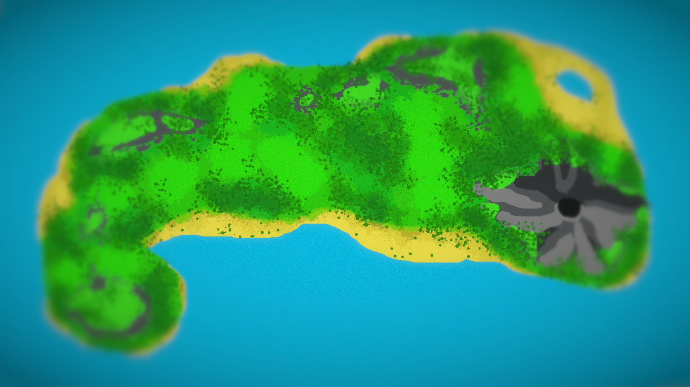

  <h1>Online Multiplayer Game:</h1>
  
  <h2></h2>
  
A quick, <i>play with your friends</i>, multiplayer game that is jam-packed with short mini-games which everyone can play and have fun in.

<h3>About:</h3>
You are able to connect to a created server useing a specific code, then join that game and walk around, vote, chat, and see your friends there doing the same.

**The structure of the game is:**

1. **Lobby area**, where you can vote on what game to play next, talk to others though a chat, and explore.
2. **Transition** into the next game, showing facts/details on how to play the game at hand.
3. **Mini-Game**, the game its self should take no longer than 2-3 minutes at most.
4. **Scores** will be showed after the round in the tranistion of going back to the lobby again.

**Scoreing:**

* The focus is not on points or ranking, it should be on getting the player to want to play the next round/game with friends.
* By the way the lobby & games are designed, it allows for interactions between people playing as a key aspect, having the Mini-Games just be something fun that fasilitates that.

<h2></h2>
<h3>Artwork:</h3>

  

  
  
<h2></h2>
<h3>🔌 Live Demo:</h3>

Well I currently only have v1.2.1 *(Not yet v2.3.0)* up live for people to view:

[✨ Try it Out! ✨](https://senario-islands-v1s2-a.glitch.me)

  **Notes:**
  * V1's only goal was to get the networking side of things working, so all the assets/artwork will & have changed already.
  * There is a minimal amount of optemizeation going on, so performance is not as good as it will be.
  * I have actualy changed the game engine *(for the game it's self, not the sign in screen)* from p5.js to phaser.js.

